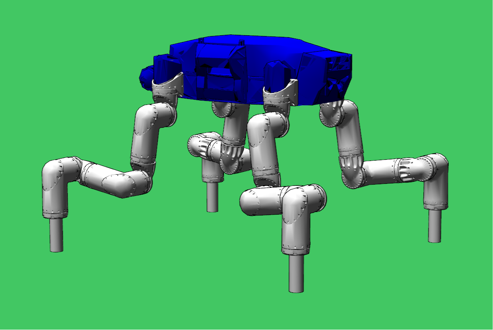

### Remote Setup
This repository uses remote:
git remote add -f CommonFile https://runningblade@bitbucket.org/runningblade/commonfile.git
git merge -s ours --no-commit CommonFile/master
git read-tree --prefix=CommonFile/ -u CommonFile/master:CommonFile
git commit -m "merged CommonFile as Remote"
git push -u origin master

### DiffNE
DiffNE is a differentiable simulator of articulated bodies using Newton-Euler's equation and minimal coordinates (no Lagrangian multipliers) with contacts handled using the maximal dissipation principle. DiffNE implement a dynamic system that is designed to be globally -continuous so the computed derivatives can be used in optimization frameworks such as iLQR/SQP/SGD. DiffNE is designed to be easily usable and tunable for trajectory optimization, inverse kinematics, MPC control, etc.

### Installation
To install DiffNE in Python2/3, type: 
```
git clone https://runningblade@bitbucket.org/runningblade/diffne.git
cd diffne
sudo python2 setup.py install 
sudo python3 setup.py install
```
To install DiffNE in C++, type:
```
git clone https://runningblade@bitbucket.org/runningblade/diffne.git
mkdir diffne-build
cd diffne-build
cmake ../diffne -DCMAKE_BUILD_TYPE=Release
make
```

### Python Interface
On the python's side, DiffNE extends Klampt by adding a single class ```DiffNERobotModel``` defined in ```Main/KlamptDiffNE.py```, ```Main/Visualizer.py```, and ```Main/KlamptDiffNE.py``` bundle. We explain the usage of DiffNERobotModel using the example defined in: ```Main/mainDebugMDPSimulatorRobosimianKlampt.py```. 

### Robot Loading
In the function ```simulate_Robosimian```, we first create a klempt world:
```python
world=klampt.WorldModel()
```
We then initialize the class ```DiffNERobotModel```:
```python
m=DiffNERobotModel(world,"Robosimian/robosimian_caesar_new_all_active.urdf")
```

### Kinematic Information Setup
Note that we currently only support URDF loading and the Klampt's native format is not supported! The main functionality of the class ```DiffNERobotModel``` is to maintain a map between DiffNE's robot configuration  and klampt's robot  used as ```RobotModel.setConfig(q)```. For example, in Robosimian, there are two many joints some of which are redundant and we would like to eliminate and fix some of them by writing:
```python
    unusedJoints=["limb1_link3","limb1_link5","limb1_link7",
                  "limb2_link3","limb2_link5","limb2_link7",
                  "limb3_link3","limb3_link5","limb3_link7",
                  "limb4_link3","limb4_link5","limb4_link7"]
    m.eliminate_joints(unusedJoints)
```
After these lines, the DiffNE's robot definition changes but its map to Klampt is maintained. The next block of code sets a plausible initial guess of robot pose for trajectory optimization, by writing:
```python
m.set_joint_angle("limb1_link2", math.pi*0.9/2)
m.set_joint_angle("limb1_link4",-math.pi/2)
m.set_joint_angle("limb1_link6", math.pi*1.1/2)
m.set_joint_angle("limb2_link2",-math.pi*0.9/2)
m.set_joint_angle("limb2_link4", math.pi/2)
m.set_joint_angle("limb2_link6",-math.pi*1.1/2)
m.set_joint_angle("limb3_link2", math.pi*0.9/2)
m.set_joint_angle("limb3_link4",-math.pi/2)
m.set_joint_angle("limb3_link6", math.pi*1.1/2)
m.set_joint_angle("limb4_link2",-math.pi*0.9/2)
m.set_joint_angle("limb4_link4", math.pi/2)
m.set_joint_angle("limb4_link6",-math.pi*1.1/2)
```
**Note** that the names of joint is not the full name but a prefix, i.e., any joint whose names starts with ```limb1_link2``` will be set to ```math.pi*0.9/2``` (DiffNE uses joint to refer to both joint and link as one joint always corresponds to one link, and DiffNE uses a built-in robot topology simplification algorithm to process the robot if this is not the case). The resulting initial robot pose will look like:


### External Wrench Setup
At this point we have set all our kinematic information, and we will move on to set dynamic information. First, DiffNE does not contain collision detection/response functionality, but DiffNE allows user to provide an ```ExternalWrench``` data structre to model any custom external forces/torques. In addition,  we provide a simple interface to ```ExternalWrench``` when your environment is just a flat ground. In this case, user can specify a set of spherical end-effectors and we assume that only there end-effector sphere can collide with a flat ground, this next block of code specifies a set of end-effector spheres:
```python
 ees=[]
 for i in range(m.body.nrJ()):
    if len(m.body.children(i,True))==0:
        ee=DNE.EndEffectorBounds(i)
        zRange=DNE.Vec3d(0,0,0)
        if   m.body.joint(i)._name.startswith("limb1"):
            zRange=DNE.Vec3d(-0.1,0,0)
        elif m.body.joint(i)._name.startswith("limb2"):
            zRange=DNE.Vec3d( 0.1,0,0)
        elif m.body.joint(i)._name.startswith("limb3"):
            zRange=DNE.Vec3d( 0.1,0,0)
        elif m.body.joint(i)._name.startswith("limb4"):
            zRange=DNE.Vec3d(-0.1,0,0)
        ee.detectEndEffector(m.body,zRange)
        ees.append(ee)
```
We first iterate over all joints of body, and then check whether a given joint is a leaf (```len(m.body.children(i,True))==0```). For each leaf joint, create a data structure ```EndEffectorBounds```. This data structure provides a convenient function:
```python
EndEffectorBounds.detectEndEffector(body,zRange)
```
here body is the DiffNE.ArticulatedBody data structure that is provided in ```DiffNERobotModel``` and ```zRange``` is a 3-element list, it means that the end-effector is a cylindar with axis parallel to zRange and radius=. **Note** that your end-effector mesh defined in URDF file might not be exactly a cylindar shape. This is not a problem, DiffNE will fit a cylinder for you. Now we have defined the 4 end-effectors for Robosimian.

### Dynamic Information Setup
Next code block defines the simulator by writing:
```python
m.create_simulator(accuracy=64)      #this will use double
m.create_simulator(accuracy=128)     #this will use quadmath
m.create_simulator(accuracy=129)     #this will use MPFR
```
User might use one of the 3 lines above to choose the internal precision of simulator. A simulator working uder 64bit precision will be using internal data type of ```np.float64```, 128bit precision will be using internal data type of ```DNE.float128```, more than 128bit precision will be using internal data type of ```DNE.mpreal```. **Note** that all these precisions are internal and all the parameters and return values will be cast back to ```np.float64```.

User might also choose to add a default joint torque calculator in the form of a PD-controller by writing:
```python
m.set_PD_controller(1000,1)
```
This PD controller will be used to calculate joint torque when no joint torque is provided to the simulator function. If neither explicit joint torque or PD controller is provided, joint torque will be set to zero. Also note that we have detected the end-effector before, do not forget to add a ground floor so that the end-effectors will take effect:
```python   
m.set_floor([0,0,1,2],ees)
```
where the equation for floor plane is the  and any point  satisfying:  is above the ground. 

### Using the Simulator
Now we have setup all the dynamics and kinematics property for the robot and we can move on to use the simulator, there are two ways to use it by calling: ```simulate``` or ```simulate_batched```.  The ```simulate_batched``` function is just a multi-threaded version of ```simulate``` that runs multiple simulations from multiple states independently, using C++ side OpenMP library to accelerate computation (The number of threads is automatically detected by DiffNE but can also be set using the ```DiffNERobotModel.set_threads``` function). This later function is very useful for long-horizon trajectory optimization. The signature of ```simulate``` is:
```python
qdqNext,Dqdq,Dtau=simulate(self,dt,qdq,tau=None,Dqdq=[True/False],Dtau=[True/False])
```
and the signature of ```simulate_batched``` is identical:
```python
qdqsNext,Dqdqs,Dtaus=simulate_batched(self,dt,qdqs,taus=None,Dqdqs=[True/False],Dtaus=[True/False])
```
Each input/output of the ```simulate_batched``` function is a list of the corresponding input/output of the ```simulate``` function. Note that the only essential input to ```simulate_batched``` is ```qdqs``` and ```len(qdqs)``` is an indicator of how many concurrent simulations you would like to run. If ```taus!=None```, then you must let ```len(taus)==len(qdqs)```. Setting ```Dqdqs=True``` indicates that you want  computed, and setting ```Dtaus=True``` indicates that you want  computed.

### Simulator Mode Explained
There is one parameter left out unexplained in the function ```create_simulator``` which is mode, we can set mode to be one of the following:
```python
mode=DNE.FORWARD
mode=DNE.INVERSE
mode=DNE.FORWARD_RK1F
mode=DNE.FORWARD_RK1I
mode=DNE.FORWARD_RK2I
mode=DNE.FORWARD_RK4I
mode=DNE.BACKWARD_RK1I
```
And the input/output of ```simulate``` will differ accordingly. Hereafter, we denote  as the number of degrees of freedom of the robot. 

### Mode=INVERSE_I
If ```mode=DNE.INVERSE_I```, then, ```simulate``` considers the equation:


which is an instantaneous inverse dynamics equation with impulse-level MDP and the input is: qdq= (a vector of size ) and the output qdqNext= (another vector of size ). dt is omitted in this mode.

### Mode=FORWARD_I
If ```mode=DNE.FORWARD_I```, then, ```simulate``` considers the equation:


which is an instantaneous forward dynamics equation with impulse-level MDP and the input is: qdq= (a vector of size ) and the output qdqNext= (another vector of size ). dt is omitted in this mode.

### Mode=INVERSE_LF
If ```mode=DNE.INVERSE_LF```, then, ```simulate``` considers the equation:


which is an instantaneous inverse dynamics equation with limiting force-level MDP and the input is: qdq= (a vector of size ) and the output qdqNext= (another vector of size ). dt is omitted in this mode.

### Mode=FORWARD_IF
If ```mode=DNE.FORWARD_I```, then, ```simulate``` considers the equation:


which is an instantaneous forward dynamics equation with limiting force-level MDP and the input is: qdq= (a vector of size ) and the output qdqNext= (another vector of size ). dt is omitted in this mode.

### Mode=INVERSE_BACKWARD_RK1F
If ```mode=DNE.FORWARD_RK1F```, then, ```simulate``` considers the equation:


which is a backward Euler integrator with force-level MDP and the input is: qdq= (a vector of size ) and the output qdqNext= (another vector of size ).

### Mode=BACKWARD_RK1F
If ```mode=DNE.FORWARD_RK1F```, then, ```simulate``` considers the equation:


which is a backward Euler integrator with force-level MDP and the input is: qdq= (a vector of size ) and the output qdqNext= (another vector of size ).

### Mode=FORWARD_RK1F
If ```mode=DNE.FORWARD_RK1F```, then, ```simulate``` considers the time-integrated, force-level Newton-Euler equation:


which is a symplectic Euler integrator with force-level MDP and the input is: qdq= (a vector of size ) and the output qdqNext= (another vector of size ).

### Mode=FORWARD_RK1I
If ```mode=DNE.FORWARD_RK1F```, then, ```simulate``` considers the equation:


which is a symplectic Euler integrator with impulse-level MDP, and the input is: qdq= (a vector of size ) and the output qdqNext= (another vector of size ).

### Mode=FORWARD_RK2I, FORWARD_RK4I
These two modes have same specification as FORWARD_RK1I, but uses second-order and forth-order Runge-Kutta integrator internally.
